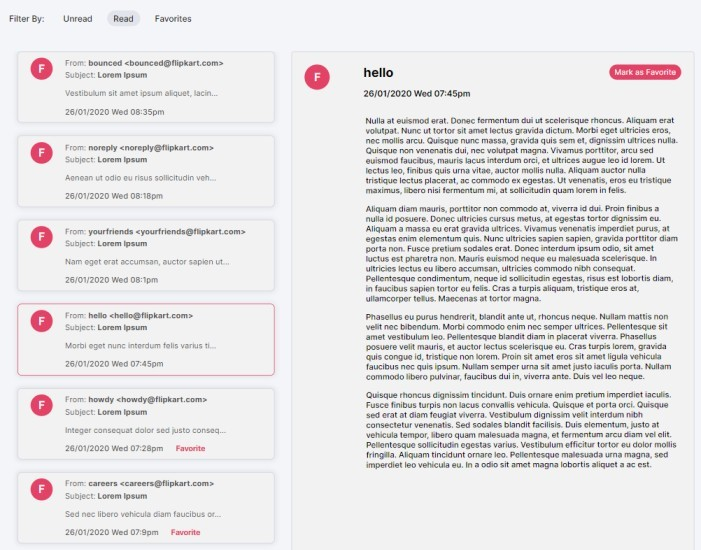

# Email Client in React

## Libraries Used
- React Redux :- for state management
- React Persist :- to persist state in session storage
- React Router Dom :- for page navigation


## How to run Locally

1. First clone or fork the repo, in the roor folder run ```npm install```.
2. After that, run the server using ```npm run dev```.


__You can view the live site *[Live Site](https://email-client-redux-react.vercel.app/)*__

### Email Client Home Page
